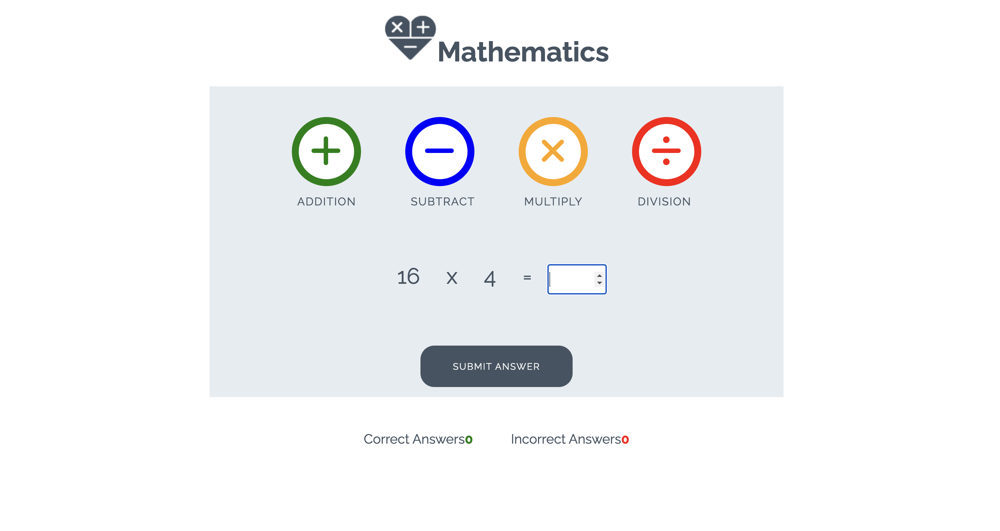

I created a JavaScript program that performs basic arithmetic operations: addition, subtraction, multiplication, and division. Below is a screenshot of the code, which demonstrates how each operation works. and this is the deployed live site link : https://vishalchapa.github.io/JS-Calculator/

 